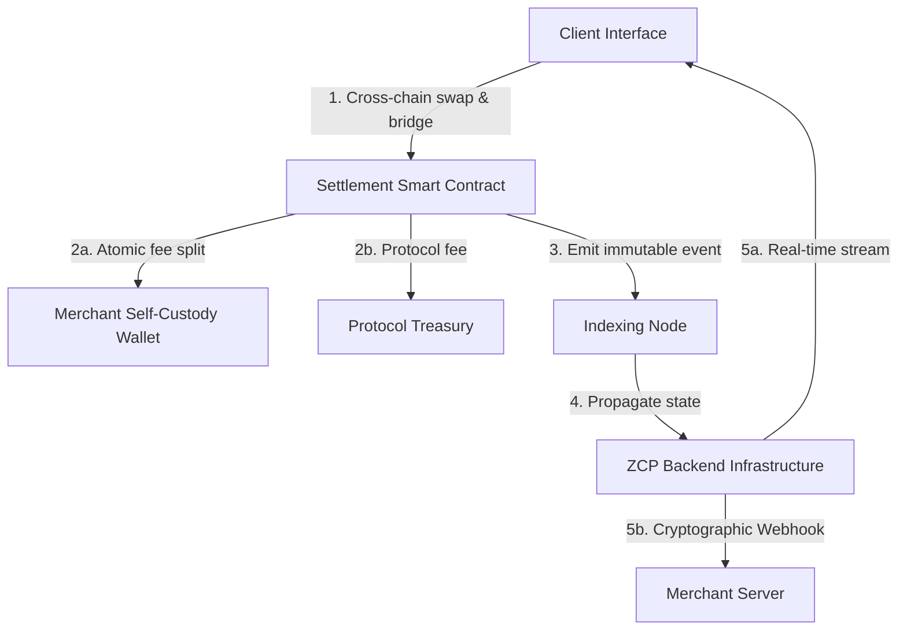
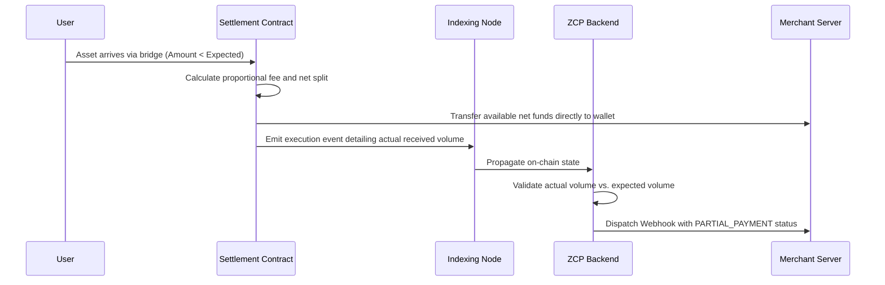

# ZCP Protocol: A Non-Custodial, Cross-Chain Infrastructure for Decentralized Commerce

**Abstract**
The proliferation of fragmented blockchain networks presents a significant friction point for decentralized commerce. Existing payment gateways often compromise on the core tenets of decentralized systems by introducing custodial intermediaries, enforcing centralized trust assumptions, or limiting cross-chain compatibility. This paper outlines the architecture of the ZCP (Zero-Custody Payment) protocol, an open-source, non-custodial infrastructure designed to facilitate seamless cross-chain transactions with deterministic settlement on a target Layer 2 (L2) network. By leveraging a client-side routing protocol, an immutable on-chain settlement smart contract, and a highly optimized off-chain event indexing system, the ZCP protocol guarantees atomic fee distribution, mitigates slippage-induced failures, and maintains strict zero-custody invariants throughout the transaction lifecycle.

## 1. Introduction

As decentralized commerce scales, merchants face a critical trilemma: maximizing the breadth of acceptable digital assets, minimizing settlement latency, and preserving self-custody. Traditional cryptocurrency payment gateways typically solve asset fragmentation by acting as custodial intermediaries, holding private keys and assuming discretionary authority over user funds.

The ZCP Protocol outlines a Business-to-Business-to-Consumer (B2B2C) model that resolves this trilemma. The system allows purchasers to initiate transactions from any supported blockchain using any asset, while guaranteeing that the merchant receives a stable, fiat-pegged digital asset on a high-throughput, low-fee L2 network. The protocol operates strictly as a transparent routing layer and never exercises control over the complete payment flow.

## 2. System Architecture

The infrastructure is composed of four distinct layers operating in concert to ensure decentralized initialization, atomic execution, and reliable state propagation.

### 2.1. Client-Side Routing Layer (Cross-Chain)

The transaction originates at the user layer. Instead of enforcing payment in a specific asset, the system utilizes a client-side liquidity routing aggregator to compute the optimal swap and bridge path. The user signs a single transaction on their native chain. This transaction automatically bridges and swaps the input asset into the designated settlement asset, routing it directly to the smart contract on the destination L2 network.

### 2.2. On-Chain Settlement Layer

The core of the non-custodial guarantee is the settlement smart contract. When the bridged funds arrive, the contract performs an atomic split:

- Protocol Fee: A predefined service fee is routed to the platform treasury, strictly capped at an absolute maximum threshold to protect users.
- Merchant Settlement: The remaining net amount is transferred directly to the merchant's predefined wallet address.
- Event Emission: Upon successful transfer, the contract emits a deterministic event containing the transaction metadata.

### 2.3. Indexing and State Management Layer

To bridge the on-chain execution with the off-chain merchant infrastructure without introducing polling inefficiencies, the system employs a dedicated indexing node.

The indexer maintains a persistent connection to the blockchain's RPC endpoints.

Upon detecting a settlement event (typically under two seconds post-block inclusion), the indexer immediately propagates the event to the centralized backend infrastructure.

### 2.4. Off-Chain Delivery Layer

The ZCP backend processes the indexed event and orchestrates two simultaneous actions:

- Real-Time Interface Updates: The payment status is streamed to the client interface via a multiplexed websocket connection, finalizing the checkout experience seamlessly.
- Asynchronous Merchant Notification: A cryptographically signed webhook (using HMAC) is dispatched to the merchant's server via a managed queue system, ensuring reliable delivery through exponential backoff mechanisms.

## 3. Threat Model and Security Analysis

The non-custodial nature of the system requires a rigid security model to protect both merchants and users from potential attack vectors.

### 3.1. Trust Assumptions

The protocol operates under the following trust assumptions:

- Smart Contract Immutability: Merchants place trust in the audited settlement contract, not in the off-chain platform backend.
- Platform Incapability: The ZCP protocol possesses no private keys associated with user or merchant funds and is cryptographically incapable of redirecting funds arbitrarily.
- Network Finality: The system relies on the sequencer and finality guarantees of the underlying L2 network.

### 3.2. Slippage and Partial Payments

Cross-chain transactions are subject to network latency and liquidity fluctuations, which can result in slippage. If the routing protocol delivers less of the settlement asset to the contract than initially quoted, the system handles the deficit gracefully.

- The contract does not revert the transaction, which would otherwise result in stranded assets on the destination chain.
- The contract distributes the received liquidity according to the established proportional logic.
- The backend validates the expected amount against the actual received amount and flags the transaction as a partial payment. The merchant's webhook payload explicitly details the deficit, delegating the final fulfillment decision to the merchant's internal business logic.

## 4. Software Engineering Methodology

To guarantee the reliability of the off-chain infrastructure, the ZCP platform is engineered using deterministic programming patterns.

### 4.1. Error Handling and Immutability

Traditional exception handling is strictly prohibited within the core business logic. All operations subject to failure must return predictable result wrappers based on functional programming paradigms. Complex asynchronous workflows, including scheduling and timeouts, are orchestrated via formal functional effects, ensuring side effects are meticulously managed.

### 4.2. Runtime Type Assertions

To mitigate data coercion vulnerabilities, especially when interfacing with external RPC nodes or client payloads, the system enforces exhaustive runtime schema validation. Discriminant unions are handled via exhaustive pattern matching, ensuring the compiler verifies that all possible transactional states are mathematically accounted for in the execution flow.

### 4.3. Financial Precision

Floating-point arithmetic is structurally excluded from the codebase. All cryptographic amounts are handled as arbitrary-precision integers at the language level, mitigating the risk of rounding errors during fee computation and asset conversion.

## 5. Conclusion

The ZCP protocol demonstrates a viable model for cross-chain decentralized commerce that does not compromise on the principle of self-custody. By decoupling the transaction routing from the final settlement, and enforcing state transitions through a deterministic smart contract paired with strict off-chain functional programming standards, the system provides a trust-minimized, highly verifiable payment infrastructure suitable for enterprise integration.
